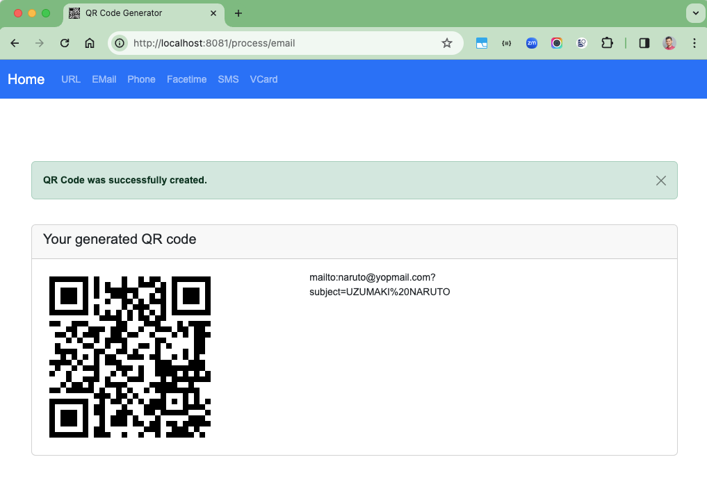

# spring-boot-qrcode-generator

### Things todo

1. Clone the repository: `git clone https://github.com/hendisantika/spring-boot-qrcode-generator.git`
2. Navigate to the folder: `cd spring-boot-qrcode-generator`
3. Run the application: `mvn clean spring-boot:run`
4. Open your favorite browser: http://localhost:8081

### Docker Way

Package the app

```shell
mvn clean package
```

Build Dockerfile

```shell
docker build -t hendisantika/qrcode-generator:latest .
```

Tag Dockerfile

```shell
docker tag hendisantika/qrcode-generator:latest hendisantika/qrcode-generator:latest
```

Run Docker Image

```shell
docker run -it --rm -p 8081:8081 --name qrcode-generator hendisantika/qrcode-generator:latest
```

Push Docker to Dockerhub

```shell
docker push hendisantika/qrcode-generator:latest hendisantika/qrcode-generator:latest
```

### Images Screenshot

Home Page


QRCode


Email




Facetime


Phone Number


SMS


